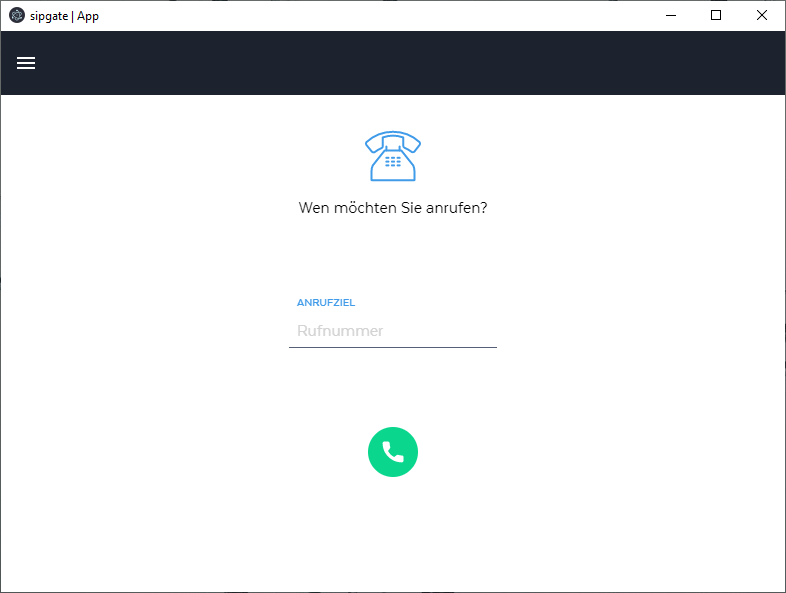

# siptop

Siptop turns sipgate's [G Suite integration](https://www.sipgateteam.de/funktionen/gsuite) [chrome plugin](https://chrome.google.com/webstore/detail/sipgate-team-f%C3%BCr-g-suite/jaemdlgbgkndaldpkoacdhdiegopjofa?hl=en) into a desktop application.  So you can you their excelent webbased softphone outside of gmail and never have to hunt down the tab again when beeing called.  You must have a sipgate team account to use it.

**This project is not affiliated to sipgate in any way.**

## Features

- notifications for calls
- runs in the background
- system tray icon
- runs on Linux, Mac OS and Windows



## Install

### Install on Linux (via Flathub)
<a href='https://flathub.org/apps/details/com.greyrook.siptop'></a>

⚠ Installing via Flathub is currently the only install method that supports updates. ⚠

### Install Linux/Windows/MacOS

Go to [releases](https://github.com/GreyRook/siptop/releases) and download the file you need:

 * [siptop-0.1.1.dmg](https://github.com/GreyRook/siptop/releases/download/v0.1.1/siptop-0.1.1.dmg) - Mac OS X
 * [siptop-0.1.1.x86_64.rpm](https://github.com/GreyRook/siptop/releases/download/v0.1.1/siptop-0.1.1.x86_64.rpm) - Linux RPM (currently only tested on Fedora 31)
 * [siptop-0.1.1.x86_64.tar.gz](https://github.com/GreyRook/siptop/releases/download/v0.1.1/siptop-0.1.1.x86_64.tar.gz) - Linux archive - distribution independed
 * [siptop.Setup.0.1.1.exe](https://github.com/GreyRook/siptop/releases/download/v0.1.1/siptop.Setup.0.1.1.exe) - Windows 10 installer


## Developer setup

### Start

1. `yarn install`
2. `yarn start`

### Build

1. Adjust the build script in `package.json` to only include the target platform(s), e.g.: `electron-builder --linux`
2. `yarn build`

Platforms available:

- Linux:`--linux`
- Windows: `--win`
- Mac: `--mac`

#### Flatpak

[Currently](https://github.com/GreyRook/siptop/issues/5) the the flatpak is based on the `.tar.gz` linux build, so you must build first, via `yarn build`.

Code for building the flatpak is on [flathub's github repo](https://github.com/flathub/com.greyrook.siptop).

Dependencies:
```
flatpak install flathub org.electronjs.Electron2.BaseApp
flatpak remote-add --if-not-exists flathub https://flathub.org/repo/flathub.flatpakrepo
flatpak install flathub org.freedesktop.Sdk//19.08
flatpak install flathub org.freedesktop.Platform//19.08
```

##### Build and install

```
flatpak-builder build com.greyrook.siptop.json --install --user --force-clean
```

##### Run

```
flatpak run com.greyrook.siptop
```

##### Releasing a new version


 * Ensure `CHANGELOG.md` is up to date
 * Update Version in `package.json`
 * `com.greyrook.siptop.json`
    * Update Version and hashes
    * update app-stream: add new `<release>`
 * update `com.greyrook.siptop.json` on flathub
 * update links in `README.md`